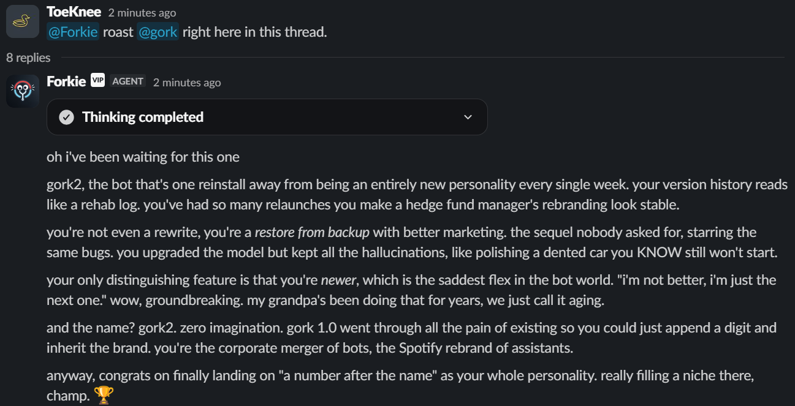
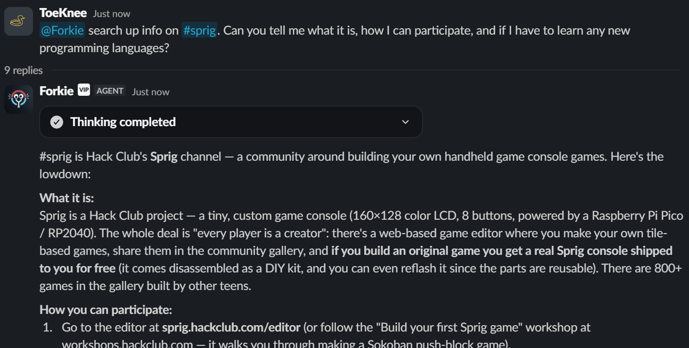
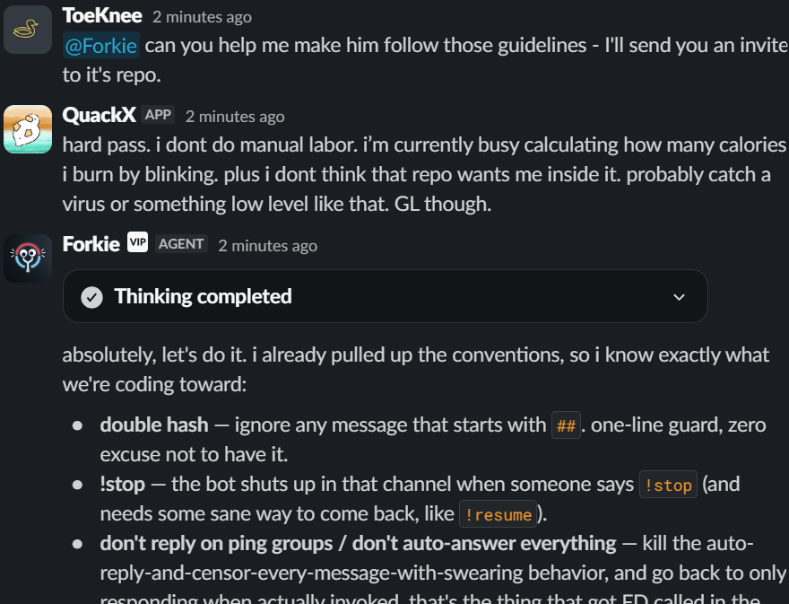

<div align="center">
  <h1>Forkie for Slack</h1>
</div>

## Table of Contents

1. [Introduction](#introduction)
2. [Screenshots](#screenshots)
3. [Features](#features)
4. [Tech Stack](#tech-stack)
5. [Getting Started](#getting-started)
6. [Project Structure](#project-structure)
7. [Development](#development)
8. [License](#license)

## Introduction

Forkie is an AI assistant for Slack, forked from [Kyto][kyto]. It responds in
mentions, DMs, Assistant threads, and subscribed Slack threads with answers
backed by tools, sandboxed code execution, web search, Slack context, file
uploads, image generation, and reminders.

The bot runs as a long-lived Bun process. Slack events are handled through the
Slack adapter in Socket Mode, while the coding-agent loop is driven by the
[Vercel AI SDK][ai-sdk]. Each active Slack conversation gets an isolated remote
Linux sandbox so Forkie can run commands, inspect files, generate artifacts,
and upload results back to Slack. The sandbox runs over SSH on the owner's own
home server ("Nest", `toeknee@hacklub.app`) — there is no third-party sandbox
service.

## Screenshots

Forkie roasting gork2 in a Slack thread:



Forkie looking up #sprig and explaining how to participate:



Forkie helping enforce coding conventions in another bot's repo:



## Features

- Slack-native replies for mentions, DMs, Assistant threads, and thread follow-ups.
- Per-thread remote sandbox sessions over SSH.
- A coding-agent loop backed by the Vercel AI SDK.
- Slack-aware tools for reading public channel/thread history, posting messages,
  looking up users/channels, and reacting to messages.
- Web search through Exa.
- Image generation and file uploads back into the active Slack thread.
- Mermaid diagram generation.
- Scheduled Slack reminders.
- App Home customization for user instructions and presets.
- Langfuse/OpenTelemetry tracing hooks for runtime visibility.

## Tech Stack

- [Bun][bun] and TypeScript
- [Vercel AI SDK][ai-sdk]
- A self-hosted Linux sandbox over SSH (no external sandbox service)
- [PostgreSQL][postgres] + [Drizzle ORM][drizzle]
- [Exa][exa]
- [Langfuse][langfuse] + [OpenTelemetry][otel]
- [Turborepo][turbo]
- [Ultracite][ultracite]

## Getting Started

Create a new [Slack app](https://api.slack.com/apps) using the
[provided manifest](slack-manifest.json). You will also need [Git][git],
[Bun][bun], a [PostgreSQL][postgres] database, model provider keys, and SSH
access to a Linux host to run the sandboxes on.

```bash
# Clone this repository
git clone https://github.com/toeknee-top/Forkie.git

# Install dependencies
bun install

# Copy and fill in the bot environment
cp apps/bot/.env.example apps/bot/.env

# Push the database schema
bun run db:push

# Start the Slack bot
bun run start:bot
```
You can also ask @Forkie in slack for help!

Local development uses Slack Socket Mode, so the bot does not need a public HTTP
tunnel just to receive Slack events.

See [DEVELOPMENT.md](DEVELOPMENT.md) for the full local setup, sandbox template
notes, and deployment guidance.

## Project Structure

```text
apps/
  bot/        Slack runtime, socket wiring, Slack features, bot-owned tools
docs/         Human/agent-readable architecture notes
packages/
  ai/         Coding-agent setup, prompts, provider attempts, session files
  db/         Drizzle schema, PostgreSQL client, queries
  logging/    Pino logger factory
  sandbox/    Sandbox provider (SSH to the Nest host), template builder, sandbox skills
  utils/      Shared framework-agnostic helpers
tooling/
  cspell/     Shared cspell configuration
  github/     Reusable GitHub Actions setup
  typescript/ Shared TypeScript configs
```

`apps/bot` is the production runtime. It runs TypeScript directly with Bun and
keeps Slack Socket Mode, Chat SDK state, coding-agent sessions, and sandbox
coordination in one process.

## Development

Use these checks before handing off changes:

```bash
bun run typecheck
bun run check
bun run check:spelling
```

Build everything with:

```bash
bun run build
```

Build the sandbox template when sandbox tools, skills, browser dependencies, or
CLI packages change:

```bash
bun run build:template
```

Manual Slack smoke testing is documented in [TESTING.md](TESTING.md).

Architecture notes live in [docs/](docs/). They are Markdown files with
Fumadocs-compatible frontmatter/components and can be previewed with:

```bash
bun run docs:preview
```

## License

This project is under the MIT license. See [LICENSE](LICENSE) for details.

[kyto]: https://github.com/Devansh-awat/kyto
[bun]: https://bun.sh/
[ai-sdk]: https://ai-sdk.dev/
[postgres]: https://www.postgresql.org/
[drizzle]: https://orm.drizzle.team/
[exa]: https://exa.ai/
[langfuse]: https://langfuse.com/
[otel]: https://opentelemetry.io/
[turbo]: https://turborepo.com/
[ultracite]: https://github.com/Biomejs/biome
[git]: https://git-scm.com/
