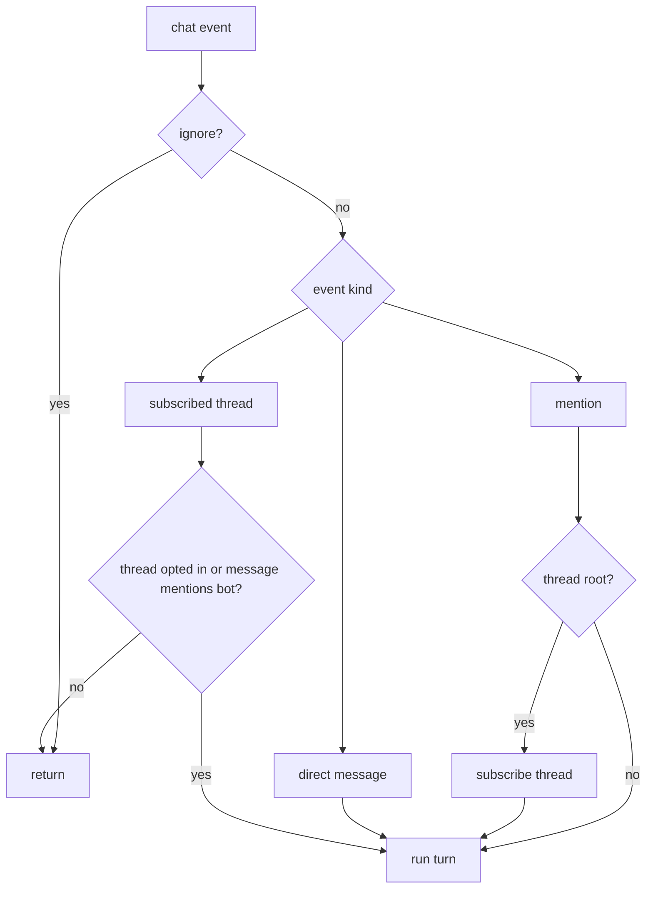

Slack events enter through Chat SDK's Slack adapter in Socket Mode. The adapter normalizes Slack events into `Thread` and `Message` objects; `apps/bot` decides whether to answer and starts the agent turn.

## Entry Points

| Handler | Purpose |
| --- | --- |
| `onNewMention` | A user mentioned Kyto. |
| `onDirectMessage` | A user sent Kyto a DM. |
| `onSubscribedMessage` | A message arrived in a thread Kyto follows. |
| `onAction('stop_turn')` | A user clicked the active-turn stop button. |

## Ignore

Any message with a line that starts with `##` is ignored. Leading Slack mention tokens are stripped before this check, so `@kyto ## ignore this` is ignored too.

Messages from bots and messages from Kyto itself are ignored.

## Access Control

When `OPT_IN_CHANNEL` is set, only members of that channel may use Kyto. The channel is how users accept the terms of service: the terms are posted there, and joining the channel is the opt-in that grants access. With `OPT_IN_CHANNEL` unset, Kyto is open to everyone.

The member list is cached in memory at startup and extended live as users join. Slack has no member-left event, so a user who leaves keeps access until the next restart — an acceptable over-permission for an opt-in gate.

## Thread Opt-In

A root mention opts the thread into follow-up responses. Kyto stores that state on the Chat SDK thread and subscribes to future replies.

A mention inside an existing thread is treated as a one-off request unless the thread was already opted in.

## DMs

DMs are direct intent. Kyto subscribes to the DM thread and answers.

> **Private context:** Reader tools must stay scoped. A user should not be able to use Kyto to read another user's private DM or private-channel context.

## Slack APIs

Chat SDK handles the normal platform shape, including cards, modals, file uploads, and scheduled messages. Kyto still uses raw Slack APIs for Slack-only behavior the SDK does not model:

- native assistant thinking status and suggested prompts;
- App Home customizations (views publish/open/update);
- assistant search;
- channel and workspace name lookups;
- the opt-in channel member list.
